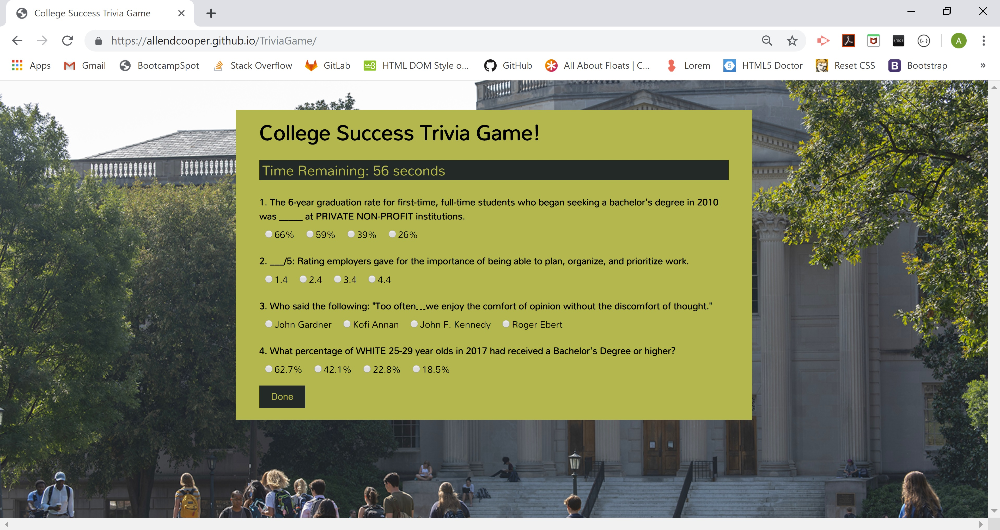

# TriviaGame
Trivia Game using JavaScript and jQuery
## Overview
I) Used JavaScript and jQuery to build the following:
    1) A question bank of trivia questions, stored as an array of objects
    2) A function to randomly pull 4 question sets from the question bank
    3) A function to render the question sets onto the document
    4) A function (endRound) to score the student results
    5) A click handler that runs endRound when the user clicks the submit button
    6) A function to create a timer that counts down from 60 seconds, and calls the endRound function when timer has elapsed.
    7) A click hander that renders question sets again, resetting the page, when the user clicks a play again button.

II) Built html document with several elements, identified with unique IDs, so that the jQuery functions could print to them. 

III) Used CSS to design the document, including adding a Google font, background image, and reset CSS for cross-browser consistency. 

### Functionality
